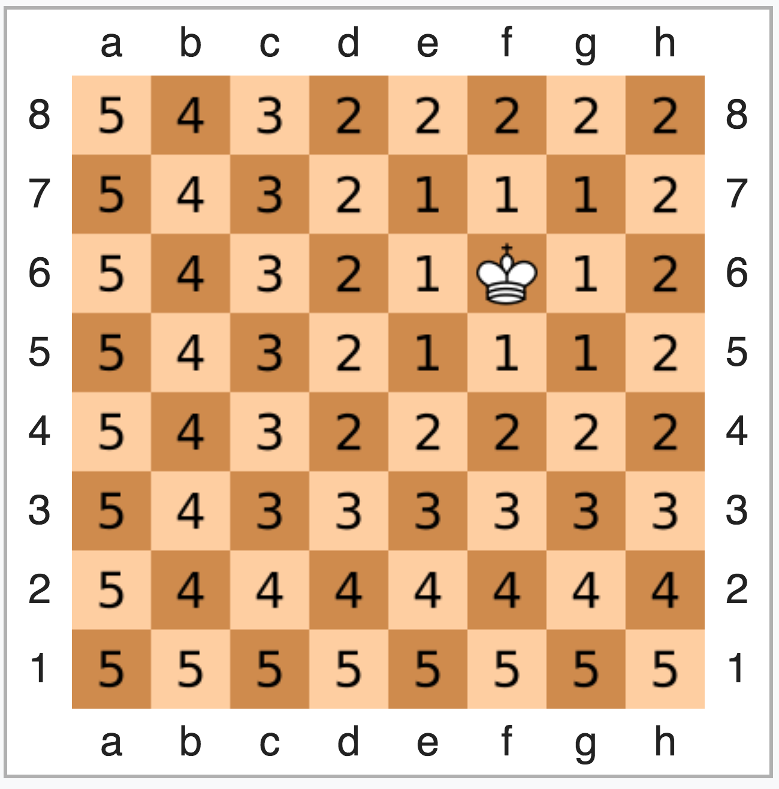

# filler

### The world famous (or infamous) board Filler

## SHORT INTRODUCTION:

The aim of this project is to create a bot which will fight other bots in the popular (or not) game Filler.

The rules are very simple. There is Virtual Machine (VM) wich takes 3 parameters: two bots and a board.
At the beginning of the game VM gives (via stdin) map with 2 dots on it - 'O' and 'X' in accordance for first and second players.
Also it gives random figure which must be placed on the board.

First bot reads the map, analyzes it and gives back the coordinates of next step.

Then VM try to put figure on the board. If it was valid coordinates second bot take updated map and another figure to make next move.
Then it continues again and again.

The game ends when the figure cannot be placed anymore.
So, if one bot gave invalid coordinates another will play until it finds free space on the map.

Every time bot place figure it earns 1 point.
The winner is the one who scored more points.

## DESCRIPTION OF THIS IMPLEMENTATION:

My Filler bot is divided into 3 parts:

1. Read input data from VM.

2. Index all positions on the board according their distance from the opponent bot.
This is the most important part, to read more about this algorithm, google **"[taxicab geometry](https://en.wikipedia.org/wiki/Taxicab_geometry)"** or **"[chebyshev distance](https://en.wikipedia.org/wiki/Chebyshev_distance)"**, or in ukrainian **"[Манхеттенська метрика](https://uk.wikipedia.org/wiki/%D0%9C%D0%B0%D0%BD%D1%85%D0%B5%D1%82%D1%82%D0%B5%D0%BD%D1%81%D1%8C%D0%BA%D0%B0_%D0%BC%D0%B5%D1%82%D1%80%D0%B8%D0%BA%D0%B0)"** or **"[Відстань Чебишова](https://uk.wikipedia.org/wiki/%D0%92%D1%96%D0%B4%D1%81%D1%82%D0%B0%D0%BD%D1%8C_%D0%A7%D0%B5%D0%B1%D0%B8%D1%88%D0%BE%D0%B2%D0%B0)"**.
Please find screenshot with example bellow.



It looks like my bot surrounds opponent's territory in a circles with numbers from smaller to bigger and this numbers show minimum distance to touch the opponent.

3. Find next move.

For this purpose bot tries to place figure on each place on the board from the upper left to the down right and check whether this position is valid.

Valid position must respond the following rules:
  - only one touch with my territory;
  - no touch with opponent territory;
  - the whole figure should fit on the board.

Than bot need to find **the best valid place**. It calculates all indexes which will be covered by figure and choose the one with the least number.

That's it!

After all 3 steps bot can print result on stdout via mine ft_printf (or via standard printf).

## FILE STRUCTURE OF PROJECT:

At the root of the repository you can find */includes* folder where header file is stored.
There are prototypes of used functions and also prototypes of used structures.

Also at the root you can find */sources* folder where stored all main functions for this project.

All other folders are additional.

In libftprintf stored my implementations of some standard libC functions.

In resources folder stored Virtual Machine code, game maps and test bots.

Makefile helps to compile and launch the program.

colors.sh - very simple script to make a visualization.

All other files have only additional purposes.

## HOW TO LAUNCH AND TEST:

First clone git repository (type in console):
```

git clone https://github.com/alikhtor/filler.git filler

```

Than go to the project folder and launch:
```

cd filler

make

./resources/filler_vm -f resources/maps/map01 -p1 ./alikhtor.filler -p2 ./resources/players/carli.filler | bash colors.sh

```

You can change map from resources/maps/(map00, map01, map02), opponent bot from /resources/players or you can fight my bot against your own.

GOOD FIGHT and

**Enjoy :)**
